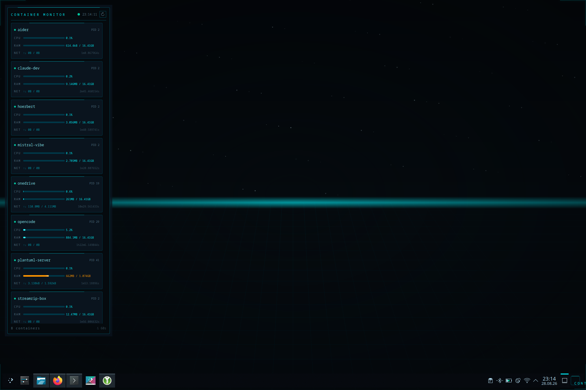
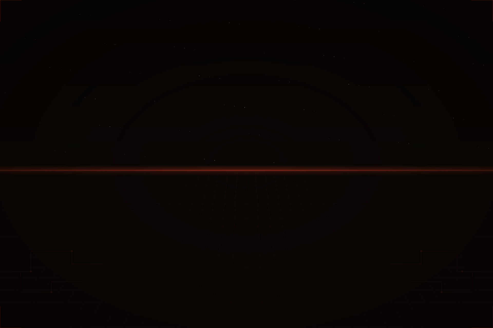

# Tron Legacy KDE Theme

> A dark, neon-cyan global theme for **KDE Plasma 6** inspired by the visual aesthetic of *Tron: Legacy*.



## Features

- **Global Theme** — Cohesive look across Plasma Desktop, panels, tooltips and dialogs.
- **Window Decorations** — Custom Aurorae theme with glow-accented title bar.
- **Splash & Lock Screen** — Animated QML boot splash and a minimal Tron-style lock screen.
- **Wallpapers** — SVG-based wallpapers generated in 16:9 and 3:2 ratios.
- **Terminal & Editors** — Color schemes for Konsole, Kate, Vim, Neovim and VS Code.
- **Container Monitor Widget** — A Plasma 6 applet that displays live CPU & RAM stats for Podman / Distrobox containers.

## Screenshots

| Desktop + Widget | Lock Screen |
|:---:|:---:|
|  |  |

> **Tip:** If the lock screen does not apply automatically, see [Troubleshooting](#troubleshooting) below.

## Requirements

- **KDE Plasma 6**
- `bash`
- `rsvg-convert` (package `librsvg`) or `inkscape`
- `podman` *(optional, only for the Container Monitor widget)*
- `sudo` *(only for the SDDM login-manager theme)*

## Installation

```bash
git clone https://github.com/YOURNAME/tron-legacy-kde-theme.git
cd tron-legacy-kde-theme
./install.sh
```

`./install.sh` will:

1. Copy the color scheme, Plasma style, Aurorae theme, look-and-feel package, wallpaper and Konsole scheme to `~/.local/share/…`
2. Install the SDDM theme to `/usr/share/sddm/themes` (requires `sudo`)
3. Generate PNG wallpapers from the SVG sources
4. Install editor themes for Vim, Neovim and VS Code
5. Install the **Tron Container Monitor** plasmoid and enable its systemd user timer

### Apply the Theme

Go to **System Settings → Appearance → Global Theme → Tron Legacy** and click *Apply*.

### Add the Container Monitor Widget

Right-click the desktop → **Add Widgets…** → search for **Tron Container Monitor**.

## Color Palette

| Role | Hex | Usage |
|------|-----|-------|
| Deep Background | `#050A0E` | Desktop, main background |
| Card / Panel | `#0A141E` | Widget cards, panels |
| Cyan Primary | `#00F5FF` | Accents, focus, highlights |
| Cyan Medium | `#0096A8` | Secondary accents |
| Cyan Dim | `#004858` | Borders, separators |
| Text Primary | `#80E8F0` / `#B4DCEB` | Foreground text |
| Text Dim | `#507080` | Inactive / disabled text |
| Orange | `#FF9500` | Warnings, attention |
| Red | `#FF3030` | Errors, high usage alerts |
| Green | `#00C8A0` | Success, running state |

## Project Structure

```
color-scheme/          KDE color scheme
plasma-style/          Plasma 6 desktop theme (SVG)
aurorae/               Window decoration (Aurorae)
look-and-feel/         Global theme package (QML splash & lockscreen)
wallpaper/             Wallpaper package (SVG sources)
sddm/                  Login-manager theme
konsole/               Terminal color scheme
kate/                  Syntax highlighting theme
vim/                   Vim colorscheme
nvim/                  Neovim Lua colorscheme
vscode/                VS Code theme extension
plasmoid/              Container Monitor widget
systemd/               User timer & service for the widget backend
install.sh             One-shot installer
```

## Updating

Run `./install.sh` again after pulling updates. It overwrites the installed files and restarts the systemd timer.

## Troubleshooting

### Lock screen does not use the Tron theme

The lock screen is controlled by KDE's *kscreenlocker*. After installing the
Global Theme it should be set automatically, but if it does not appear:

1. Open **System Settings → Workspace Behavior → Screen Locking**
2. Under **Appearance** select **Tron Legacy** (or `com.tronlegacy.desktop`)
3. Alternatively, run:
   ```bash
   kwriteconfig6 --file kscreenlockerrc --group Greeter --key Theme com.tronlegacy.desktop
   ```
4. Test with `Ctrl+Alt+L`

### Widget shows "Data file not found"

The systemd timer is not running. Start it manually:
```bash
systemctl --user daemon-reload
systemctl --user enable --now tron-containers.timer
```

### Plasma shell does not restart after `killall plasmashell`

Use `kstart5 plasmashell &` or simply log out and back in.

## Trademarks

**Disclaimer:** *Tron Legacy KDE Theme* is an independent, fan-made project. It is **not affiliated with, endorsed by, or sponsored by Disney**.  
*TRON™* is a trademark of Disney Enterprises, Inc.

## License

This project is licensed under the **GNU General Public License v2.0 or later** — see the [LICENSE](LICENSE) file for details.
